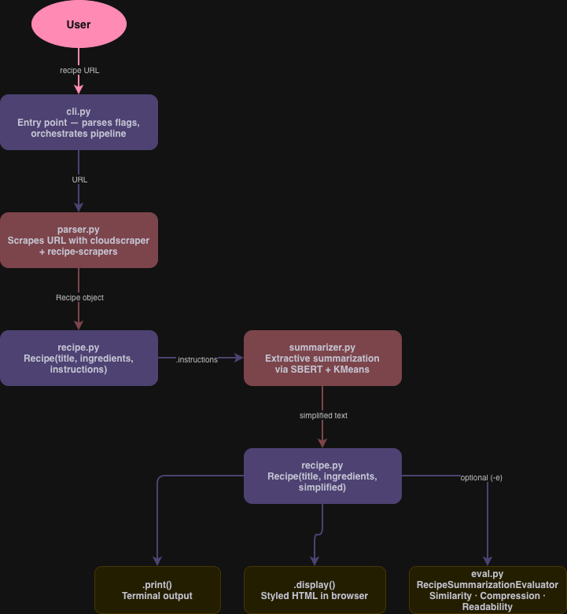

# Recipe Simplifier

A command-line tool that scrapes a recipe from any URL, simplifies the directions using extractive summarization, and optionally evaluates the quality of the simplification. The goal is to make recipes easier to follow while cooking — shorter text, simpler language, same meaning.

---

## How It Works

Cooking recipes found online are often verbose. They include long explanations, redundant phrasing, unnecessary detail, and are cluttered with ads and pop-ups that make them harder to follow in a kitchen setting. Recipe Simplifier takes any recipe URL, extracts the directions, and uses an extractive summarization model to keep only the most essential sentences — reducing cognitive load without losing critical steps.

The pipeline has four stages:

1. **Parse** — scrape the recipe URL and extract title, ingredients, and directions
2. **Summarize** — run extractive summarization on the directions text
3. **Output** — print to terminal or render as a styled HTML page in the browser
4. **Evaluate** *(optional)* — score the simplification on semantic similarity, compression, and readability

---

## Architecture

The diagram below shows how the modules connect:

   

---

## Installation

Requires Python 3.11+ and [uv](https://github.com/astral-sh/uv).

```bash
git clone https://github.com/rvt9bx/dsan5400-project.git
cd dsan5400-project
uv sync
```

---

## Usage

### Basic — simplify a recipe and print to terminal

```bash
uv run recipe-simplifier -u "https://www.allrecipes.com/recipe/10813/best-chocolate-chip-cookies/" -p
```

### Open in browser as a styled HTML page

```bash
uv run recipe-simplifier -u "https://www.allrecipes.com/recipe/10813/best-chocolate-chip-cookies/" -d
```

### Save the HTML to a file

```bash
uv run recipe-simplifier -u "https://www.allrecipes.com/recipe/10813/best-chocolate-chip-cookies/" -d -s outputs/my_recipe.html
```

### View the original recipe without simplification

```bash
uv run recipe-simplifier -u "https://www.allrecipes.com/recipe/10813/best-chocolate-chip-cookies/" -p -og
```

### Simplify and evaluate the result

```bash
uv run recipe-simplifier -u "https://www.allrecipes.com/recipe/10813/best-chocolate-chip-cookies/" -p -e
```

### All flags

| Flag | Long form | Description |
|------|-----------|-------------|
| `-u` | `--url` | Recipe URL to scrape *(required)* |
| `-p` | `--print` | Print result to terminal |
| `-d` | `--display` | Open result as HTML in browser |
| `-s` | `--save` | File path to save HTML output |
| `-og` | `--original` | Use original directions, skip summarization |
| `-e` | `--evaluate` | Score the simplification quality |

---

## Example Output

**Terminal (`-p`)**
```
Best Chocolate Chip Cookies

INGREDIENTS:
- 2 1/4 cups all-purpose flour
- 1 teaspoon baking soda
- ...

INSTRUCTIONS:
1. Preheat oven to 375 degrees F.
2. Beat butter and sugars until creamy.
3. Add eggs and vanilla. Stir in flour mixture.
4. Bake for 9 to 11 minutes or until golden brown.
```

**Evaluation (`-e`)**
```
========================================
       SIMPLIFICATION EVALUATION
========================================
  Semantic Similarity:      0.9231
  Compression Ratio:        0.4800
  Readability (Original):   8.2000
  Readability (Simplified): 5.1000
  Readability Improvement:  0.3780
----------------------------------------
  Overall Score:            0.5937
  Rating:                   Moderate
========================================
```

---

## Parser 

The pipeline uses the [recipe-scrapers python package](https://docs.recipe-scrapers.com/). To scrape recipe website HTML and parse. Currently over 600 recipe websites are supported by recipe-scrapers and thus also by our recipe simplifier. View the supported sites [here](https://docs.recipe-scrapers.com/getting-started/supported-sites/). 

## Summarizer

The summarizer uses the MultiExtractiveSummarizer extractive summarization model from the [MultiExtractiveSummarizer python package](https://pypi.org/project/MultiExtractiveSummarizer/).

Parameters:
1. **embedding_method** — sbert
2. **summarization_method** — kmeans

Hyperparameters:
1. **ratio** — tuned to 0.5

All together the summarizer model uses Sentence-BERT embeddings on the text, creates sentence clusters using k-means, and outputs around 0.5 of the original text in the summarization.

## Evaluation Metrics

The evaluator scores simplifications on three dimensions:

| Metric | What it measures | Good score |
|--------|-----------------|------------|
| **Semantic Similarity** | Cosine similarity between original and simplified directions using Sentence-BERT (`all-MiniLM-L6-v2`). Checks that meaning was preserved. | Close to 1.0 |
| **Compression Ratio** | Word count of simplified ÷ original. Measures how much shorter the output is. | Below 1.0 |
| **Readability Improvement** | Drop in Flesch-Kincaid grade level. Measures whether language got simpler. | Positive |

Overall score = average of all three. Ratings:

| Score | Rating |
|-------|--------|
| ≥ 0.80 | Very Strong Simplification |
| ≥ 0.65 | Good |
| ≥ 0.50 | Moderate |
| < 0.50 | Weak |

---

## Module Overview

| Module | Role |
|--------|------|
| `cli.py` | Entry point. Parses CLI flags and orchestrates the pipeline. |
| `parser.py` | Scrapes a recipe URL using `cloudscraper` and `recipe-scrapers`, returns a `Recipe` object. |
| `recipe.py` | `Recipe` dataclass. Handles terminal printing and HTML rendering/display. |
| `summarizer.py` | Cleans directions text and runs `MultiExtractiveSummarizer` (SBERT + KMeans) to extract key sentences. |
| `eval/eval.py` | `RecipeSummarizationEvaluator` class. Computes similarity, compression, and readability metrics. |
| `scripts/iterator.py` | Batch pipeline — runs the summarizer and evaluator across a CSV of recipes. |

---

## Project Structure

```
dsan5400-project/
├── src/
│   └── recipe_simplifier/
│       ├── cli.py              # CLI entry point
│       ├── parser.py           # URL scraping
│       ├── recipe.py           # Recipe class
│       ├── summarizer.py       # Extractive summarization
│       ├── utils.py            # Browser opening utility
│       └── eval/
│           └── eval.py         # Evaluation metrics
├── scripts/
│   ├── iterator.py             # Batch CSV pipeline
│   ├── main.py                 # Batch run script
│   └── preprocessing.py        # Train/test split
├── notebooks/
│   └── eda.ipynb               # Exploratory data analysis
├── data/
│   └── full_dataset.csv        # 2.2M recipe dataset
├── outputs/                    # Saved HTML and results
├── tests/                      # Unit tests
└── pyproject.toml
```

---

## Data

The dataset used for batch evaluation and hyperparameter tuning is the **RecipeNLG** corpus (~2.2M recipes). Download `full_dataset.csv` from the [RecipeNLG project](https://recipenlg.cs.put.poznan.pl/) (Bień et al., INLG 2020 — [paper](https://aclanthology.org/2020.inlg-1.4.pdf)) and place it at `data/full_dataset.csv`. The `data/` directory is excluded from version control.

---

## Authors

- Eleanor Byrd
- Maura Mann
- Nkemdibe Okweye
